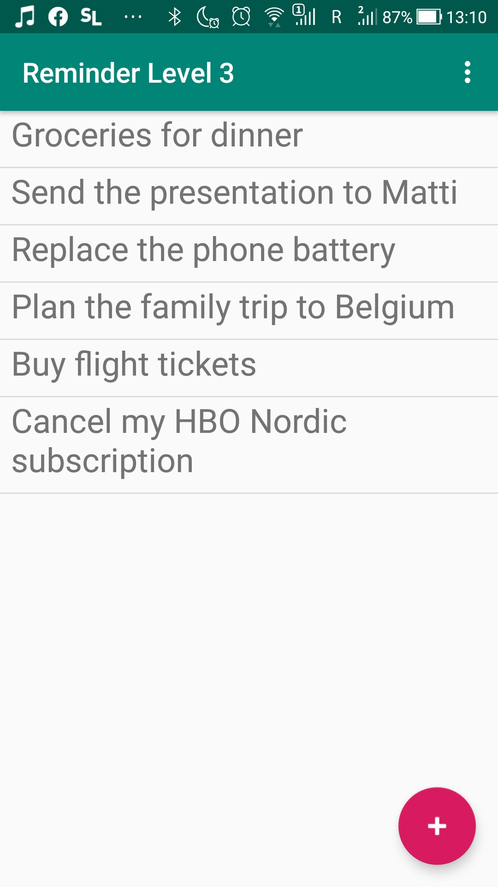
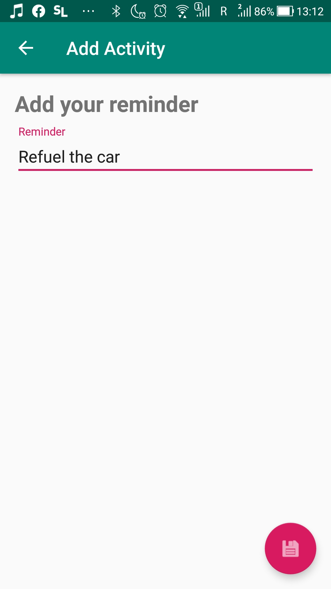

# Level 3 Example - Reminder app
This is the example that was shown on the third seminar. However, I have done it earlier because I aim at completing all 7 levels and I am completing the easier ones quicker in order to have more time to focus on the higher and more difficult levels.
## What's inside
This is the app that can be used to write down your reminders. Basically, it's the same as the example for level 2. However, this time we have moved the adding of a reminder to a separate activity. We have also practiced the way we can pass an object to another activity using Parcelable.
## Screenshots
    
